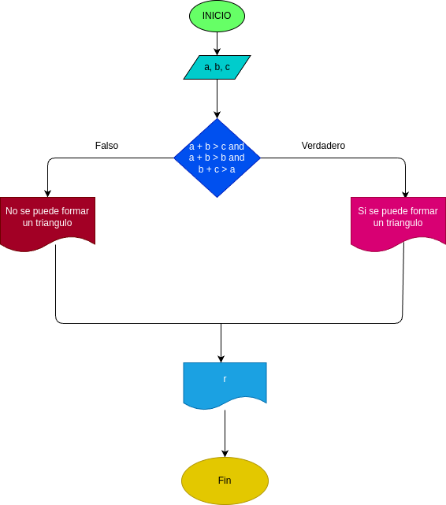

# Quiz instrucciones condicionales

### Realice el análisis, diseño y construcción para resolver el siguiente problema:

Dados tres números a, b y c, correspondientes a la longitud de los lados de una figura geométrica, determinar si pueden formar los lados de un triángulo.

## input

### Variables de entrada
a: longitud del primer lado del triangulo 

b: longitud del segundo lado del triangulo

c: longitud del tercer lado del triangulo

### processing 
resultado: determinar si los valores ingresados pueden formar un triangulo 

Reglas de validacion:
si se cumplen las siguientes condiciones simultaneamente:
- a + b > c
- a + c > b
- b + c > a

Entonces, los valores  ingresados  pueden formar  un triangulo.
De lo contrario, no se puede formar un triangulo.

### output
resultado: Mensaje indicando si los valores forman un triangulo o no.

### Diagrama de flujo
